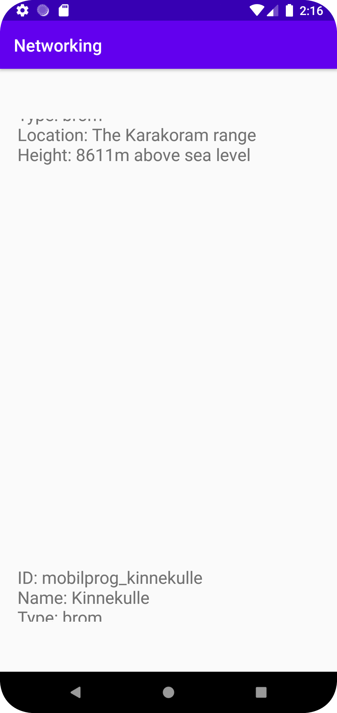

Målet med uppgiften var att utifrån den information som togs från webplatsen kunna visa i aktiviteten genom en recyclerView.
RecyclerView är användbart då, till skillnad från ListView där alla element laddas ned, så gäller det bara de element som är på skärmen samt några fler både över och under.
En Mountain java fil gjordes med variabler, constructor och getter som en mall för objekten som kommer att parse från Json.
Ännu en xml fil skapades då det är i denna TextView objekten kommer att visas i.
En RecyclerViewAdapter behövdes för datahantering och i denna fil skapades ännu en klass "ViewHolder".
För att denna RecyclerViewAdapter skulle kunna ärva metoder från RecyclerView.Adapter behövdes tre metoder overide (onCreateViewHolder, onBindViewHolder och getItemCount).
Till sist behövdes allt kopplas ihop till Json URL där datan skulle importeras ifrån vilket gjordes inom MainActicity.


```
public class RecyclerViewAdapter extends RecyclerView.Adapter<RecyclerViewAdapter.ViewHolder> {

    private ArrayList<Mountain> mountainList;

    public RecyclerViewAdapter(MainActivity mainActivity, ArrayList<Mountain> mountainList){
        this.mountainList = mountainList;
    }

    public class ViewHolder extends RecyclerView.ViewHolder {
        private TextView mountainText;

        ViewHolder(View view) {
            super(view);
            mountainText = view.findViewById(R.id.textView);
        }
    }

    @NonNull
    @Override
    public RecyclerViewAdapter.ViewHolder onCreateViewHolder(@NonNull ViewGroup parent, int viewType) {
        View itemView = LayoutInflater.from(parent.getContext()).inflate(R.layout.list_mountains, parent, false);
        return new ViewHolder(itemView);
    }

    @SuppressLint("SetTextI18n")
    @Override
    public void onBindViewHolder(@NonNull RecyclerViewAdapter.ViewHolder holder, int position) {

        String ID = mountainList.get(position).getID();
        String name = mountainList.get(position).getName();
        String type = mountainList.get(position).getType();
        String location = mountainList.get(position).getLocation();
        int height = mountainList.get(position).getHeight();

        holder.mountainText.setText("ID: " + ID + "\nName: " + name + "\nType: " + type + "\nLocation: " + location + "\nHeight: " + height + "m above sea level");
    }

    @Override
    public int getItemCount() {
        return mountainList.size();
    }
}
```
```
public class MainActivity extends AppCompatActivity implements JsonTask.JsonTaskListener {

    private final String JSON_URL = "https://mobprog.webug.se/json-api?login=brom";

    private ArrayList<Mountain> mountainList;
    private RecyclerView recyclerView;
    RecyclerViewAdapter recyclerViewAdapter;

    @Override
    protected void onCreate(Bundle savedInstanceState) {
        super.onCreate(savedInstanceState);
        setContentView(R.layout.activity_main);

        new JsonTask(this).execute(JSON_URL);
        recyclerView = findViewById(R.id.recyclerView);
        mountainList = new ArrayList<>();
        recyclerViewAdapter = new RecyclerViewAdapter(this, mountainList);
        RecyclerView.LayoutManager layoutManager = new LinearLayoutManager(getApplicationContext());
        recyclerView.setLayoutManager(layoutManager);
        recyclerView.setAdapter(recyclerViewAdapter);
    }

    @Override
    public void onPostExecute(String json) {

        Gson gson = new Gson();
        Type type = new TypeToken<ArrayList<Mountain>>() {}.getType();
        ArrayList<Mountain> mountainListArray = gson.fromJson(json, type);
        mountainList.addAll(mountainListArray);
        recyclerViewAdapter.notifyDataSetChanged();
        Log.d("MainActivity", json);
    }

}
´´´


